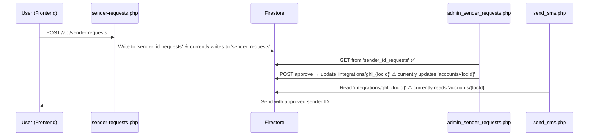

# Backend Handoff — Sender ID Request Flow

**Date:** 2026-03-19  
**From:** Raely (Frontend)  
**To:** David (Backend)  
**Status:** 🔴 Flow is broken end-to-end — needs alignment

---

## Intended Flow

```
User fills form → Submit → Firestore (sender_id_requests) → Admin Dashboard → Approve/Reject → Firestore (integrations) → SMS Engine uses approved sender
```



---

## 🔴 Bug 1: Collection Name Mismatch (Requests)

The user API and admin API target **different collections**:

| File | Collection Used | Should Be |
|:--|:--|:--|
| `api/sender-requests.php` | `sender_requests` ❌ | `sender_id_requests` |
| `api/admin_sender_requests.php` | `sender_id_requests` ✅ | `sender_id_requests` |

**Result:** User submits a request but Admin Dashboard never sees it.

### Fix
In `api/sender-requests.php`, change:
```diff
- $db->collection('sender_requests')
+ $db->collection('sender_id_requests')
```
This applies to **both** the GET query (line 31) and the POST write (line 76).

---

## 🔴 Bug 2: Collection Name Mismatch (Account Data)

Account data is stored in `integrations` (by `ghl_callback.php` and `account-sender.php`) but read from `accounts` by others:

| File | Collection Used | Doc ID Format | Should Be |
|:--|:--|:--|:--|
| `ghl_callback.php` | `integrations` ✅ | `ghl_{locId}` | Keep |
| `api/account-sender.php` | `integrations` ✅ | `ghl_{locId}` | Keep |
| `api/admin_sender_requests.php` | `accounts` ❌ | `{locId}` | `integrations` / `ghl_{locId}` |
| `api/webhook/send_sms.php` | `accounts` ❌ | `{locId}` | `integrations` / `ghl_{locId}` |
| `api/account.php` | `accounts` ❌ | `{locId}` | `integrations` / `ghl_{locId}` |

**Result:** Admin approves and writes to `accounts/{locId}`, but when SMS is sent, it reads from `accounts/{locId}` too — BUT the free credits / API key are in `integrations/ghl_{locId}`. Data is split across two collections.

### Fix for `admin_sender_requests.php` (line 65)
```diff
- $accountRef = $db->collection('accounts')->document($locId);
+ $docId = 'ghl_' . preg_replace('/[^a-zA-Z0-9_-]/', '_', $locId);
+ $accountRef = $db->collection('integrations')->document($docId);
```

### Fix for `send_sms.php` (line 144)
```diff
- $accountDoc = $db->collection('accounts')->document($account_id)->snapshot();
+ $docId = 'ghl_' . preg_replace('/[^a-zA-Z0-9_-]/', '_', $account_id);
+ $accountDoc = $db->collection('integrations')->document($docId)->snapshot();
```

Also update the free usage increment on line 181:
```diff
- $db->collection('accounts')->document($account_id)->set([
+ $db->collection('integrations')->document($docId)->set([
```

### Fix for `account.php` (lines 53-55)
```diff
- $accountRef = $db->collection('accounts')->document($locId);
+ $docId = 'ghl_' . preg_replace('/[^a-zA-Z0-9_-]/', '_', $locId);
+ $accountRef = $db->collection('integrations')->document($docId);
```

---

## 🟡 Bug 3: API Key Field Name

The frontend sends `nola_pro_api_key`, but `account-sender.php` only checks `semaphore_api_key`.

> **Note:** The frontend now sends **both** fields for backward compatibility. No immediate action needed, but please standardize to `nola_pro_api_key` when you can.

---

## ✅ Frontend Changes Already Applied

| File | Change |
|:--|:--|
| `AdminLayout.tsx` | Fixed response checks from `json.success` → `json.status === 'success'` |
| `AdminLayout.tsx` | Fixed action payloads: sends `status: 'approved'` / `status: 'rejected'` instead of `action: 'approve'` |
| `AdminLayout.tsx` | Fixed API key injection: sends `api_key` field matching backend expectation |
| `senderRequests.ts` | Sends both `semaphore_api_key` and `nola_pro_api_key` for compat |

---

## Summary of Backend Files to Change

| # | File | What to Change |
|:--|:--|:--|
| 1 | `api/sender-requests.php` | Collection `sender_requests` → `sender_id_requests` |
| 2 | `api/admin_sender_requests.php` | Collection `accounts` → `integrations`, Doc ID → `ghl_{locId}` |
| 3 | `api/webhook/send_sms.php` | Collection `accounts` → `integrations`, Doc ID → `ghl_{locId}` |
| 4 | `api/account.php` | Collection `accounts` → `integrations`, Doc ID → `ghl_{locId}` |
