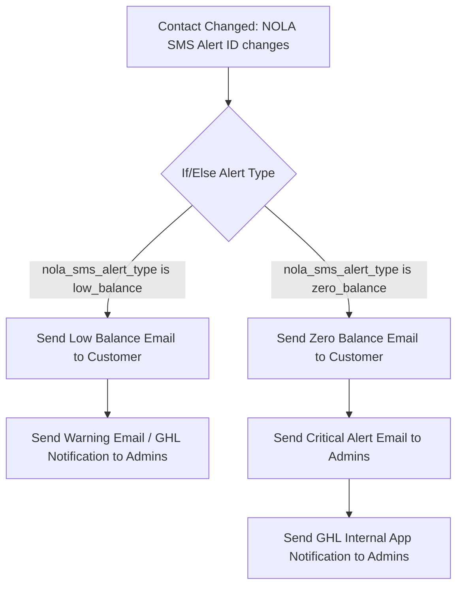

# Backend Handoff — Admin Low/Zero Balance Alerts & Internal Notifications

**Date:** 2026-06-08  
**Priority:** High  
**Status:** Proposed  

---

## Overview

This handoff details the backend implementation required to support automated notifications when a customer subaccount’s balance falls below their threshold or reaches zero:

1. **Automated Admin Email Alerts**: Sent via the central GoHighLevel (GHL) workflow.
2. **Internal Admin Notifications**: Stored in a new Firestore collection `admin_notifications` and queried via a new `/api/admin_notifications.php` endpoint to support a "bell icon" notification feed in the Admin Portal.

---

## 1. Firestore Schema: `admin_notifications`

Create a new root collection `admin_notifications` to store system notifications for the Admin Portal dashboard.

### Document Schema
```typescript
interface AdminNotification {
  id: string;             // Auto-generated Firestore Document ID
  type: 'low_balance' | 'zero_balance';
  location_id: string;    // Subaccount GHL Location ID
  location_name: string;  // Name of the subaccount workspace
  email: string;          // Registered user email for the subaccount
  balance: number;        // Credit balance at the time of the alert
  threshold: number;      // Subaccount's low balance threshold setting
  created_at: Timestamp;  // Firestore Server Timestamp
  read: boolean;          // Read status (default: false)
}
```

### Database Updates for Circuit Breakers
To handle the alert types independently and prevent spam, we update the integration settings document (`integrations/ghl_{location_id}`) to track both events separately:
*   `notification_preferences.last_low_balance_notified_at` (Timestamp)
*   `notification_preferences.last_zero_balance_notified_at` (Timestamp)

---

## 2. Notification Service Changes

**File:** [api/services/NotificationService.php](file:///C:/Users/User/nola-sms-pro-backend/api/services/NotificationService.php)

Modify `checkLowBalance()` to identify whether the alert is a **zero balance** event (blocking) or a standard **low balance** warning, and bypass/respect circuit breakers accordingly:

```php
    public static function checkLowBalance($db, string $locationId, int $currentBalance): void
    {
        // 1. Load source-location notification preferences
        $prefs = self::getPreferences($db, $locationId);

        if (!$prefs['low_balance_alert_enabled']) {
            return;
        }

        $threshold = $prefs['low_balance_threshold'];

        $intDocId = 'ghl_' . preg_replace('/[^a-zA-Z0-9_-]/', '_', $locationId);
        $docRef   = $db->collection('integrations')->document($intDocId);

        // 2. Reset circuit breakers if balance recovers above threshold
        if ($currentBalance >= $threshold) {
            $snap = $docRef->snapshot();
            if ($snap->exists()) {
                $existingPrefs = $snap->data()['notification_preferences'] ?? [];
                if (isset($existingPrefs['last_low_balance_notified_at']) || isset($existingPrefs['last_zero_balance_notified_at'])) {
                    unset($existingPrefs['last_low_balance_notified_at']);
                    unset($existingPrefs['last_zero_balance_notified_at']);
                    $docRef->set(['notification_preferences' => $existingPrefs], ['merge' => true]);
                    error_log("[LowBalanceAlert] Cleared last_low_balance_notified_at and last_zero_balance_notified_at for location {$locationId}");
                }
            }
            return;
        }

        // 3. Determine alert type
        $alertType = ($currentBalance <= 0) ? 'zero_balance' : 'low_balance';

        // 4. Check appropriate circuit breaker (24-hour limit)
        $snap = $docRef->snapshot();
        $existingPrefs = [];
        if ($snap->exists()) {
            $data = $snap->data();
            $existingPrefs = $data['notification_preferences'] ?? [];
            
            $breakerField = ($alertType === 'zero_balance') 
                ? 'last_zero_balance_notified_at' 
                : 'last_low_balance_notified_at';
                
            $lastNotified = $existingPrefs[$breakerField] ?? null;
            if ($lastNotified) {
                $lastTs = $lastNotified instanceof \Google\Cloud\Core\Timestamp
                    ? $lastNotified->get()->getTimestamp()
                    : (int) $lastNotified;
                
                if (time() - $lastTs < 86400) {
                    // Suppress duplicate alert (already sent within last 24h)
                    return;
                }
            }
        }

        // 5. Resolve registered account details
        $details = self::getAccountDetails($db, $locationId);
        $email   = $details['email'];
        $name    = $details['name'] ?? 'NOLA Owner';

        if (!$email) {
            error_log("[LowBalanceAlert] No registered account email found for location {$locationId}, skipping alert.");
            return;
        }

        $sourceLocationName = '';
        if ($snap->exists()) {
            $sourceLocationName = (string) ($snap->data()['location_name'] ?? '');
        }

        // 6. Sync to Central GHL Location (triggers GHL Workflow)
        error_log("[LowBalanceAlert] Triggering central GHL sync for location {$locationId} (email: {$email}, balance: {$currentBalance}, type: {$alertType})");
        $centralContactId = self::syncCentralLowBalanceAlertContact(
            $db,
            $locationId,
            $email,
            $name,
            $currentBalance,
            $threshold,
            $sourceLocationName,
            $alertType // Pass the dynamically resolved alert type
        );

        // 7. Save metadata and update circuit breaker key
        $now = new \DateTimeImmutable();
        $timestampField = ($alertType === 'zero_balance') 
            ? 'last_zero_balance_notified_at' 
            : 'last_low_balance_notified_at';

        $existingPrefs[$timestampField] = new \Google\Cloud\Core\Timestamp($now);
        $existingPrefs['last_low_balance_email_sent_to'] = $email;

        if ($centralContactId !== null) {
            $existingPrefs['last_low_balance_email_status']  = 'sent';
            $existingPrefs['central_ghl_alert_contact_id']   = $centralContactId;
        } else {
            $existingPrefs['last_low_balance_email_status'] = 'failed';
        }
        $docRef->set(['notification_preferences' => $existingPrefs], ['merge' => true]);

        // 8. Create Internal Admin Notification in Firestore
        try {
            $db->collection('admin_notifications')->add([
                'type'          => $alertType,
                'location_id'   => $locationId,
                'location_name' => $sourceLocationName,
                'email'         => $email,
                'balance'       => $currentBalance,
                'threshold'     => $threshold,
                'created_at'    => new \Google\Cloud\Core\Timestamp($now),
                'read'          => false
            ]);
            error_log("[AdminNotification] Successfully logged {$alertType} notification for {$locationId}");
        } catch (\Throwable $e) {
            error_log("[AdminNotification] Failed to log internal admin notification: " . $e->getMessage());
        }
    }
```

> [!NOTE]
> Update the helper method signature `syncCentralLowBalanceAlertContact` to accept `$alertType` parameter and dynamically map it to `'nola_sms_alert_type' => $alertType` in the `alertFields` payload.

---

## 3. New API Endpoint: `/api/admin_notifications.php`

Create an endpoint to query, read, and manage notifications inside the Admin Portal. Ensure it is guarded using `require_admin_auth()`.

### A. List Notifications
*   **Method**: `GET`
*   **Query Parameters**:
    *   `unread_only` (optional): Set to `true` to filter for unread alerts.
    *   `limit` (optional, default: 20): Maximum records to retrieve.
*   **Response (200 OK)**:
    ```json
    {
      "status": "success",
      "data": [
        {
          "id": "notif_doc_uuid_123",
          "type": "zero_balance",
          "location_id": "loc_abc888",
          "location_name": "Active Agency",
          "email": "owner@example.com",
          "balance": 0,
          "threshold": 50,
          "created_at": "2026-06-08T13:00:00Z",
          "read": false
        }
      ]
    }
    ```

### B. Mark Notifications as Read
*   **Method**: `POST`
*   **Payload**:
    ```json
    {
      "action": "mark_read",
      "notification_id": "notif_doc_uuid_123" 
    }
    ```
    *(Or pass `"action": "mark_all_read"` to update all unread notifications)*
*   **Response (200 OK)**:
    ```json
    {
      "status": "success",
      "message": "Notification updated successfully"
    }
    ```

---

## 4. GoHighLevel (GHL) Workflow Updates

In the central **NOLA CRM** location, modify the existing workflow **NOLA SMS Pro - Low Balance Notification**:



### Steps to configure in GHL Workflow Builder:
1.  **Modify Conditions**: In the existing `Condition` block (If/Else), add a new branch:
    *   **Branch Name**: `Zero Balance`
    *   **Rule**: `NOLA SMS Alert Type` is `zero_balance`
2.  **Zero Balance Email (Customer)**:
    *   Subject: `Urgent: Your NOLA SMS Pro sending is suspended (Zero Credits)`
    *   Body: Inform the customer that their balance reached zero and SMS is currently blocked until a top-up is completed.
3.  **Admin Email Notification**:
    *   Add a new **Send Email** action inside the `Zero Balance` and `Low Balance` branches.
    *   Configure `To Email` to point directly to the admin group (e.g. `admin@nolacrm.io`).
    *   Subject: `[Critical] Subaccount Zero Balance: {{contact.custom_fields.nola_sms_source_location_name}}`
    *   Body: 
        ```text
        Workspace: {{contact.custom_fields.nola_sms_source_location_name}}
        Location ID: {{contact.custom_fields.nola_sms_source_location_id}}
        Registered Email: {{contact.custom_fields.nola_sms_registered_email}}
        Current Balance: {{contact.custom_fields.nola_sms_balance}} credits
        ```
4.  **Send Internal Notification (GHL App)**:
    *   Add a **Send Internal Notification** action.
    *   Select **Notification Type**: Internal Notification (Bell) or SMS / Email to assigned user.
    *   Configure recipients as NOLA Admin users to trigger alerts directly inside the GHL dashboard/mobile app.

---

## 5. Verification & Testing

1.  **Test Case A: Low Balance Alert Trigger**
    *   Set a test location's balance to 55 and threshold to 50.
    *   Trigger an SMS sending event that costs 10 credits (balance becomes 45).
    *   Verify:
        *   Firestore document in `admin_notifications` is created with type `low_balance` and `read: false`.
        *   GHL contact is updated with type `low_balance`.
        *   Customer receives the low balance email.
2.  **Test Case B: Zero Balance Alert Bypassing Low Balance Breaker**
    *   Immediately trigger another SMS event that costs 45 credits (balance becomes 0).
    *   Verify:
        *   Even though less than 24 hours have passed since the `low_balance` notification, the `zero_balance` alert triggers immediately.
        *   Firestore document in `admin_notifications` is created with type `zero_balance`.
        *   Central GHL workflow is triggered with type `zero_balance`.
        *   Admins receive the critical alert email.
3.  **Test Case C: Circuit Breaker Suppression**
    *   Try to send another message (re-triggering low/zero balance check).
    *   Verify that no duplicate notifications are sent to either the customer or the `admin_notifications` collection within 24 hours.
4.  **Test Case D: Recovery Reset**
    *   Top up the balance to 100.
    *   Verify both circuit breaker fields (`last_low_balance_notified_at` and `last_zero_balance_notified_at`) are cleared.
