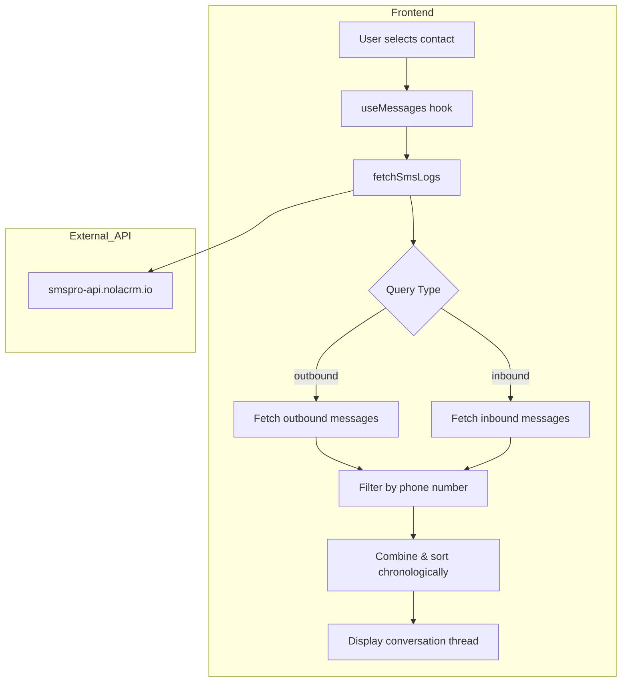

# SMS Message History - Problem Analysis & Solution Plan

## Problem Statement

Currently, when viewing a contact's message history, only "Hello from NOLA SMS" appears for all contacts because:
1. The API query uses `direction=outbound&number={phone}` but the external API may not filter by number properly
2. The API returns messages with `numbers` array (bulk messages to multiple recipients) rather than per-contact threads
3. There's no distinction between inbound (replies) and outbound (sent) messages

## Current Data Structure

```
API Response: https://smspro-api.nolacrm.io/api/messages?direction=outbound&limit=50

{
  "data": [
    {
      "message_id": "abc123",
      "numbers": ["09123456789", "09876543210"],  // ← Array, not single number
      "message": "Hello from NOLA SMS",
      "sender_id": "NOLACRM",
      "status": "Sent",
      "date_created": "2026-02-25T16:44:56.740000Z"
    }
  ]
}
```

## Desired Solution (Like GHL/Nola CRM)

A proper SMS messaging web app should show:
- **Conversation threads** per phone number
- **Both inbound and outbound** messages
- **Proper filtering** by phone number
- **Real-time feel** with message status

## Proposed Solution

### Option A: Fix the API Query (Recommended)
Modify the frontend to properly query and display messages:

1. **Update SmsLog type** to match API response (add `direction` field)
2. **Fix fetchSmsLogs** to handle the `numbers` array properly
3. **Add inbound messages** support by querying `direction=inbound`
4. **Filter messages client-side** by matching phone number in the `numbers` array
5. **Create conversation view** showing both sent and received messages

### Implementation Steps

1. **Update TypeScript Types** ([`src/types/Sms.ts`](src/types/Sms.ts))
   - Add `direction` field to SmsLog
   - Add support for inbound messages

2. **Update API Fetch Logic** ([`src/api/sms.ts`](src/api/sms.ts))
   - Fetch both inbound and outbound messages
   - Filter by phone number from the `numbers` array

3. **Update Message Hook** ([`src/hooks/useMessages.ts`](src/hooks/useMessages.ts))
   - Load both inbound and outbound messages
   - Sort chronologically (like a conversation)

4. **Optional: Backend Enhancement**
   - If API supports it, add proper per-number filtering server-side

## Architecture Diagram



## Key Changes Summary

| File | Change |
|------|--------|
| `src/types/Sms.ts` | Add `direction` field to SmsLog interface |
| `src/api/sms.ts` | Fetch both inbound/outbound, filter by phone in array |
| `src/hooks/useMessages.ts` | Combine and sort messages chronologically |

This solution will create a proper messaging experience like GHL/Nola CRM where each contact has their own conversation thread showing all messages exchanged.
